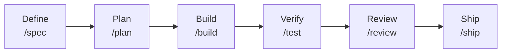
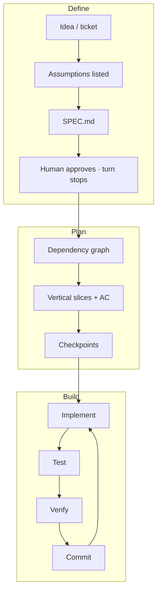
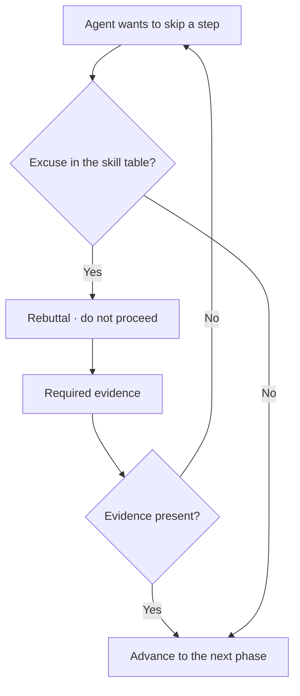
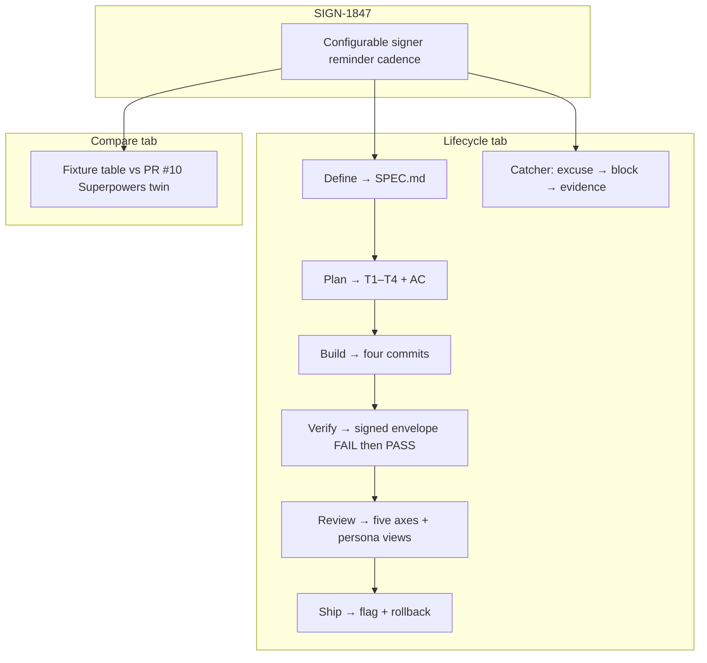

# How agent-skills works (and how this demo maps)

[addyosmani/agent-skills](https://github.com/addyosmani/agent-skills) is a pack of **25 skills** and **9 slash commands** that encode a senior-engineering lifecycle for coding agents. Skills are workflows (steps, checkpoints, exit criteria), not essays. Every skill ships a **Common Rationalizations** table — excuses agents use to skip a step — plus **required evidence**. “Seems right” is never enough.

This demo does not run Claude Code or OpenCode. It replays one Lumin Sign ticket with fixtures so you can see the artifacts and the gate.

## Lifecycle stages

| Phase | Command | Skill | Artifact in this demo |
| --- | --- | --- | --- |
| Define | `/spec` | `spec-driven-development` | `SPEC.md` — six core areas |
| Plan | `/plan` | `planning-and-task-breakdown` | Vertical tasks + acceptance criteria |
| Build | `/build` | `incremental-implementation` | Thin-slice commit log |
| Verify | `/test` | `test-driven-development` | RED → GREEN → REFACTOR |
| Review | `/review` | `code-review-and-quality` | Five-axis review, severity labels |
| Ship | `/ship` | `shipping-and-launch` | Checklist + rollback plan |

The other three commands (`/constraints`, `/code-simplify`, `/webperf`) sit beside this spine. `/webperf` is how the web-performance persona is invoked; `/ship` fans out **staff + QA + security** only.

## Anti-rationalization gate

Agents default to the shortest path. The pack treats that as a bug.

Examples from upstream, used in the catcher:

| Excuse | Skill | Reality |
| --- | --- | --- |
| “Too small for a spec” | spec-driven-development | Still need acceptance criteria |
| “I’ll add tests later” | test-driven-development | You won’t; after-the-fact tests check implementation |
| “I’ll figure it out as I go” | planning-and-task-breakdown | Hidden deps stay hidden |
| “It works, that’s good enough” | code-review-and-quality | Tests miss architecture and security |
| “We don’t need a feature flag” | shipping-and-launch | A kill switch is the one-minute rollback |

Four **personas** (`code-reviewer`, `test-engineer`, `security-auditor`, `web-performance-auditor`) are roles, not routers. Personas do not invoke personas. Slash commands orchestrate.

## How the demo maps

| Demo surface | Upstream idea |
| --- | --- |
| Six-step timeline | README lifecycle + slash commands |
| Parchment SPEC cards | Six core areas in `spec-driven-development` |
| Task AC + checkpoints | `planning-and-task-breakdown` templates |
| Slice commits | Increment cycle in `incremental-implementation` |
| RED log first | Prove-It pattern in `test-driven-development` |
| Nit / Optional / FYI | Severity prefixes in `code-review-and-quality` |
| Persona tabs | `agents/*.md` — staff, QA, security, webperf |
| Rollback plan | `shipping-and-launch` rollback template |
| Catcher | Common Rationalizations + Verification |
| Compare | `docs/comparison.md` vs obra/superpowers; PR #10 method named |

The reminder ticket reuses `scheduleReminders` on purpose: the spec’s **Never** boundary is “do not add a cron builder.” That is the kind of constraint a spec exists to lock *before* an agent reaches for a library.

**Fair vs Superpowers:** Superpowers is stronger as a long autonomous inner loop (brainstorm → plan → TDD → execute, worktrees, task reviewer). agent-skills is stronger at walking a product change through review, security, and launch with a human gate at each phase. Do not run both packs as the active router.
