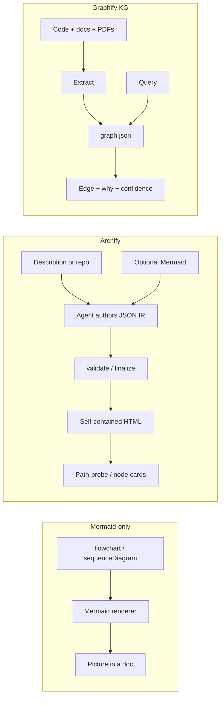
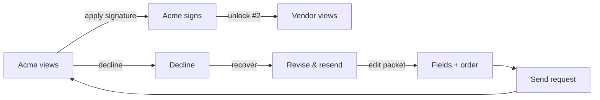

# How Archify works (and what this demo fakes)

Concept note for the Lumin Sign MSA countersign explorer. Not an API reference.

Upstream: **[tt-a1i/archify](https://github.com/tt-a1i/archify)** (MIT) — an agent skill that turns a **system description or repository** into **validated, self-contained interactive HTML** diagrams. Agents author a **typed JSON IR**; Archify **deterministically compiles** it (validate → deliver / finalize → optional browser-check). Five diagram types: architecture, workflow, sequence, data-flow, lifecycle.

Sibling demo: **[Graphify contract KG](../graphify-contract-kg/)** walks a **knowledge graph** of parties, clauses, and explained edges. This demo walks **authored diagram relationships** (workflow edges / sequence messages) with **path-probe**. Same source bookmark, different pick (`2104895659157684597-archify`).

## Mermaid-only vs Archify vs Graphify

A pasted Mermaid `flowchart` / `sequenceDiagram` is a **picture**: topology lives in the markdown, layout is the renderer’s, and “is there a path from Send to Complete?” is a human staring at arrows. Archify **reads Mermaid for meaning**, then authors **fresh typed JSON** — it does not mechanically restyle Mermaid.

Graphify extracts a **queryable graph** from a corpus (code, docs, PDFs). Nodes are entities; edges carry `EXTRACTED` / `INFERRED` / `AMBIGUOUS` plus a why. That answers *how does liability relate to indemnification?* It is not a swimlane or sequence diagram.

| | Mermaid-only | Archify | Graphify |
| --- | --- | --- | --- |
| Source of truth | Markdown diagram text | Typed JSON IR (`schema_version`, `diagram_type`, structural arrays) | `graph.json` nodes + explained edges |
| Output | SVG/PNG in a doc | Self-contained HTML viewer (search, focus, route probe, cards) | Queryable KG + `graph.html` |
| Path question | Eyeball the arrows | Path-probe over **authored** directed relations; fail closed | `graphify path A B` / query |
| Inference | Renderer layout | **None** for routes — geometry is not a hop | `INFERRED` edges are explicit and tagged |
| Best for | Quick sketches | Presentable, checkable system maps | Contract / codebase *relationships* |



```
Mermaid-only          Archify                         Graphify
------------          -------                         --------
flowchart TD          workflow.json                   Party ──owes──► Obligation
  send --> view         lanes / nodes / edges                   │
  view --> sign         mainPath + semanticChecks               └──stated_in──► Clause
                      probe(send, complete)           cite: edge why
                      hops or fail-closed             EXTRACTED | INFERRED
```

## Core idea: typed JSON IR, then a viewer

Archify’s contract (see their [schema README](https://github.com/tt-a1i/archify/blob/main/archify/schemas/README.md) and [viewer runtime](https://github.com/tt-a1i/archify/blob/main/archify/references/viewer-runtime.md)):

1. **Choose a type.** Workflow = ordered work, gates, branches. Sequence = callers, callees, returns, timing.
2. **Author IR.** Required: `schema_version`, `diagram_type`, `meta.title`, portable `meta.output`, and the type’s structural arrays. Unknown fields fail closed (`additionalProperties: false`).
3. **Validate / finalize.** Schema + layout + delivery receipt. Repository-backed diagrams can pin Git evidence; this demo does not.
4. **Explore without inventing topology.** Node cards (Semantic Passport lite), path / route probe of **exactly two endpoints** over authored directed relationships, optional trace motion.

**Route / path-probe** never infers a hop from how arrows look. If `signVendor → draft` is not a directed walk of `edges[]`, the answer is *no authored route*.

## How this demo maps to that

Happy path is **offline**. No Archify CLI, no agent, no API key.

| Production Archify | This demo |
| --- | --- |
| Agent writes JSON from a prompt or repo | Fixture `public/ir/msa-countersign.*.json` |
| `validate` / `finalize` / `deliver` | Lightweight in-browser shape check + **IR valid** badge |
| Generated self-contained HTML | Custom SVG viewer that *consumes* the same IR shape |
| Route Probe / Semantic Passport | Path-probe + node cards + upstream/downstream |
| Five diagram types + presets + export | Workflow + sequence only; no PNG/WebM/Share Cards |

Pipeline the UI actually runs:

**fixture typed JSON IR → custom HTML viewer → path highlight / node card / path-probe**

- Workflow nodes sit on **lanes × columns**. `mainPath` is the complete countersign story. Decline is an explicit `role: error` edge.
- Sequence messages are timed (`y ≥ 160`) relationships between participants. Decline recovery is a later **authored segment**, not a shortcut drawn across the happy path.
- Canned scenarios only highlight IDs that exist in the IR.

## Example walk: “Can we complete after a decline?”



Path-probe `decline → complete` walks **revise → fields → send → … → complete**. Path-probe `signVendor → draft` fails: nothing points backward along the main path. A Mermaid screenshot cannot answer that without a human; a Graphify KG would answer a *different* question (which clause carves out which obligation).

## What this is not

- Not the Archify compiler, skill package, or `finalize` receipt.
- Not Mermaid restyled as HTML.
- Not Graphify: there is no entity extract, no `EXTRACTED`/`INFERRED` tags, no vector store either.
- Not a live Lumin Sign API. The envelope is a fixture story.

Run the app from [README.md](./README.md). Generate real diagrams with [github.com/tt-a1i/archify](https://github.com/tt-a1i/archify).
