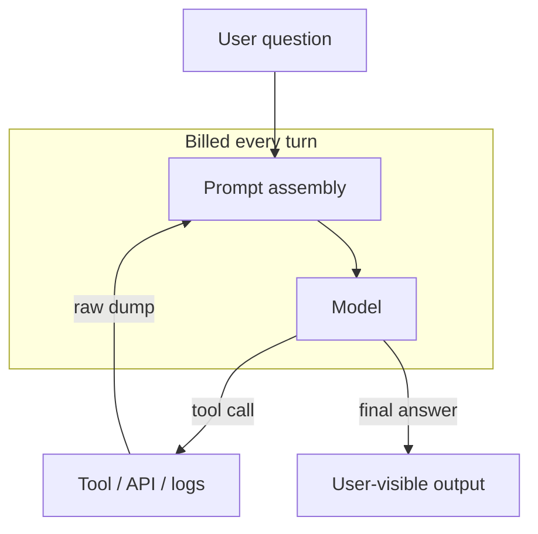
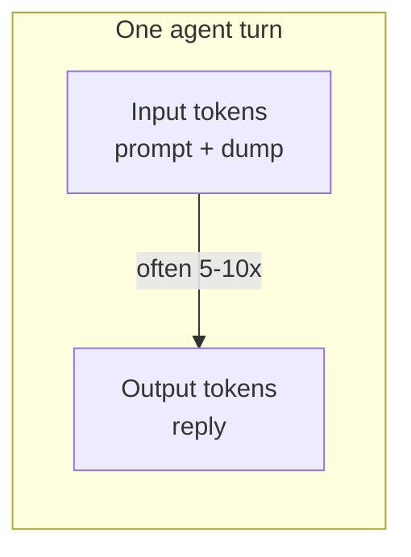
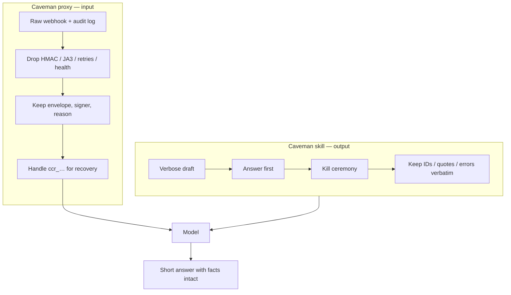
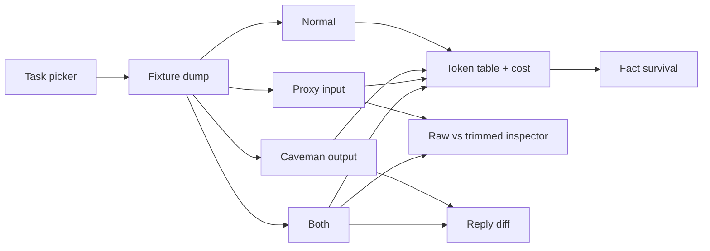

# How the Caveman token diet works

Caveman is two different tools that people collapse into one joke. This demo keeps them apart.

1. **Output skill** — a prompt that makes the model *write* less. Code, paths, IDs, and errors stay byte-exact.
2. **Input proxy** — a local compressor that makes the model *read* less. Logs, JSON, and tool dumps get a smaller view; the original can be recovered from a handle.

The viral install is (1). The CaveBench “~33% fewer input tokens” claim is mostly (2). Agents usually ingest 5–10× more tokens than they emit, so (1) alone cannot move most of a session bill. Caveman's [HONEST-NUMBERS.md](https://github.com/JuliusBrussee/caveman/blob/main/docs/HONEST-NUMBERS.md) is explicit about that.

This file maps those ideas onto the Lumin Sign ops replay.

## Where tokens go in an agent loop

A coding or ops agent does not “answer a question” once. It loops: read context, call a tool, read the tool dump, think, maybe call again, then write.

Typical cost pile, largest first:

| Bucket | What it is | Who shrinks it |
| --- | --- | --- |
| Tool output + files | Webhook dumps, audit JSON, test logs | **Input proxy** |
| System + tools + memory | Always resent (sometimes cached) | Memory compress / smaller tools |
| Skill text | Caveman rules themselves | Honesty: this is *added* input |
| Model output | The reply you read | **Output skill** |

If the dump is 8k tokens and the reply is 400, deleting half the reply saves 200 output tokens. Deleting half the dump saves 4k input tokens. That is the skeptic graph.

## Output skill vs input proxy

Rules of thumb the demo is built to show:

- **Skill without proxy:** output drops; input *rises* by the skill text (~1k tokens upstream; this demo includes an excerpt so the overhead is visible).
- **Proxy without skill:** input drops a lot on noisy JSON/logs; the reply can stay chatty.
- **Both:** the stacked diet. Still not a promise of 33% on your traffic.
- **Fact survival:** a smaller dump is useless if `ENV-MSA-7F2C91` or the decline quote disappears.

Upstream CaveBench (author-published, August 2026 Claude Code suite): 33.2% fewer *provider input* tokens, 18/18 exact answers, case-clustered 95% interval 14.6–48.5%, HTML case 9.9% *worse*. Do not quote that interval as this demo's result.

## How this demo maps

The product framing is a **Lumin Sign ops agent**: someone pastes a webhook firehose and asks why an MSA died, what an audit trail says, or which stalled envelopes need reminders.

| Demo control | Real Caveman piece | What you should see |
| --- | --- | --- |
| **Normal** | No skill, no proxy | Full dump + chatty ops prose |
| **Caveman output** | `/caveman` skill | Same dump + skill excerpt on input; short reply; facts quoted |
| **Proxy input** | Local engine / `caveman shrink` | Slim dump with `ccr_demo_…`; same chatty reply |
| **Both** | Skill + proxy together | Smaller input *and* smaller output |
| **Fact survival** | “Meaning never dropped” + exact-answer gate | Names, envelope IDs, clause 8.4 still present |
| **Live toggle** | Your own model | Optional; fixtures stay the default |

Implementation notes:

- Offline replies are deterministic fixtures, not a hidden LLM.
- The demo compressor is intentionally simple (drop noise keys, collapse debug lines, dedupe retries). The real engine has per-shape compressors and a SQLite recovery store.
- Token counts use `estimateTokens` in `src/tokens.ts` (chars/4 blended with words). Fine for ranking diets; not tiktoken; not a billing page.
- Cost uses illustrative Sonnet-class list rates ($3 input / $15 output per 1M). Labeled as such.

## Read next

- [README.md](./README.md) — run + manual test
- [Caveman SKILL.md](https://github.com/JuliusBrussee/caveman/blob/main/skills/caveman/SKILL.md)
- [Proxy / “big rock”](https://github.com/JuliusBrussee/caveman#big-rock-the-proxy)
- [WRAP-BENCHMARK.md](https://github.com/JuliusBrussee/caveman/blob/main/docs/WRAP-BENCHMARK.md)
- [HONEST-NUMBERS.md](https://github.com/JuliusBrussee/caveman/blob/main/docs/HONEST-NUMBERS.md)
