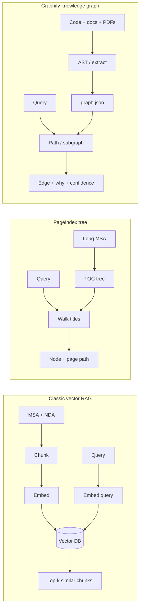
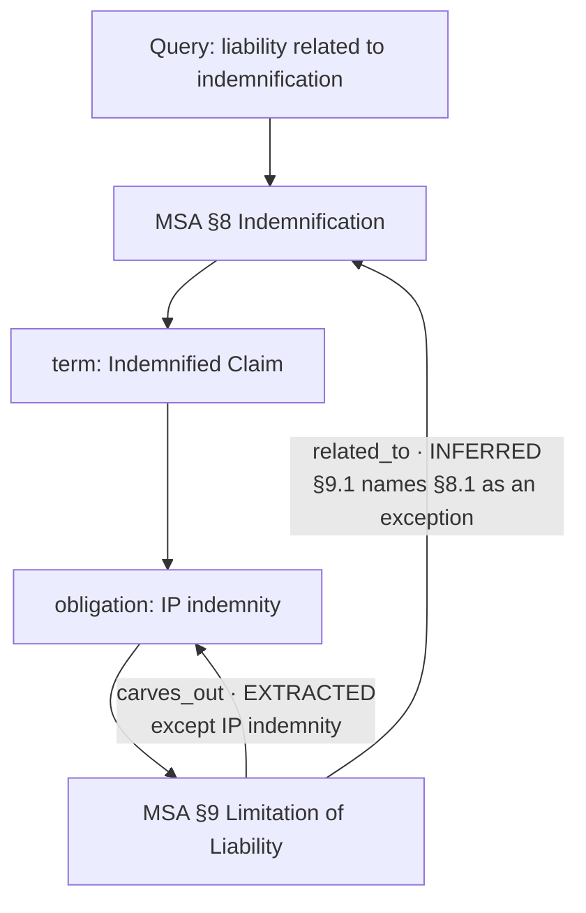

# How Graphify works (and what this demo fakes)

Concept note for the Lumin Sign contract knowledge-graph demo. Not an API reference.

Upstream: **[Graphify-Labs/graphify](https://github.com/Graphify-Labs/graphify)** (Apache-2.0) — local, deterministic parse of **code + docs + PDFs** into a **queryable knowledge graph**. Every edge is tagged `EXTRACTED`, `INFERRED`, or `AMBIGUOUS`, and the product promise is that you can always ask **why** two things are connected. **No vector store.**

Sibling demo: **[PageIndex contract Q&A](../pageindex-contract-qa/)** walks a **tree** (a TOC). This demo walks a **graph** (explained edges).

## Vector RAG vs Graphify vs PageIndex

Classic RAG **cuts the corpus into chunks**, embeds them, and **searches by similarity**. That is fast, but similarity ≠ a legal relationship: “shall not be liable” near a disclaimer is not the same as a cap that **carves out** IP indemnity.

PageIndex **keeps the document’s outline**. Retrieval is “which section would a lawyer open next?” — a reasoned **tree walk**. Citations look like `Article 10 → 10.2.1 → p.14`. It still does not tell you that §9 **limits** Lumin **except** for the §8.1 obligation.

Graphify **extracts entities and relations** (AST for code via tree-sitter; LLM/pass for docs and PDFs) and stores them as a graph. A query is a **path** (or a subgraph). The citation is the **edge**, and the edge carries a why.

| | Vector RAG | PageIndex | Graphify |
| --- | --- | --- | --- |
| Index | Chunks + embeddings + vector DB | Hierarchical TOC tree | Nodes + explained edges (`graph.json`) |
| Retrieve | Nearest-neighbor / hybrid | Reasoned walk down the outline | Query / path over the graph |
| Cite | “Chunk #47” | Article → clause → page | `source --relation--> target` + why + confidence |
| Weak spot | Similar-but-wrong clauses | No cross-article *relationship* object | Needs a good extract; inferred edges can be wrong |



```
Vector RAG          PageIndex                 Graphify
---------           ---------                 --------
chunk ──embed──►    Article
  ·                 └─ 10 Liability           Party ──owes──► Obligation
  ·                    └─ 10.2.1 Cap                    │
query ──embed──►       cite: tree path                  └──stated_in──► Clause
nearest chunks                                  cite: edge why
                                                EXTRACTED | INFERRED
```

## Core idea: explained edges

Upstream Graphify (see their [how-it-works](https://github.com/Graphify-Labs/graphify/blob/v8/docs/how-it-works.md)):

1. **Pass 1 — code (local, no LLM).** tree-sitter AST: classes, calls, imports.
2. **Pass 2 — media (local).** transcripts, seeded by god nodes.
3. **Pass 3 — docs / papers / PDFs.** extractors emit `{nodes, edges}` fragments; merge into one graph.
4. **Cluster.** Leiden communities — **no embeddings**. Semantic `related_to` edges *are* the similarity signal.
5. **Query later.** `graphify query` / `graphify path A B` read `graph.json` instead of the raw corpus.

Every edge has:

- `relation` — a verb (`owes`, `defines`, `carves_out`, `incorporates`, …)
- `confidence` — `EXTRACTED` (in the source), `INFERRED` (reasonable deduction), `AMBIGUOUS` (review)
- **why** — in this demo, a plain-English sentence a reviewer can read without opening NetworkX

God nodes are highest-degree concepts (here: Confidential Information, the MSA, the parties).

## How this demo maps to that

Happy path is **offline**. No Graphify CLI, no Claude, no API key.

| Production Graphify | This demo |
| --- | --- |
| Parse a folder of code/docs/PDFs | Fixture MSA + NDA markdown package |
| `graphify-out/graph.json` (NetworkX node-link) | `public/fixtures/graph.json` + in-memory TS corpus |
| `EXTRACTED` / `INFERRED` / `AMBIGUOUS` | Same tags on every edge |
| `graphify query` / `graphify path` | Canned chips with a scripted path walk |
| vis.js `graph.html` | Custom SVG graph, Lumin Sign review chrome |
| Optional MCP / watch / wiki | Not shipped |

Pipeline the UI actually runs:

**fixture package → prebuilt graph.json → canned path walk → highlight + edge why**

- Nodes are typed for contract review: `party`, `document`, `clause`, `obligation`, `term`, `exhibit` (Graphify’s `file_type` stays `document`).
- Edges always include `why`. Click any edge — not only canned ones.
- Optional Live: Vite probes `graphify --version`. If the CLI is present the header control lights up; **answers still come from the fixture**. A real hook would shell `graphify query` / `graphify path`.

## Example walk: “How does liability relate to indemnification?”



A vector store might retrieve both “shall not be liable” and “shall indemnify” as similar. The graph states the **relationship**: the cap **carves out** the IP indemnity. That is the review question before signature.

## What this is not

- Not a vector database with a graph painted on afterward.
- Not PageIndex: there is no TOC walker and no page-path citation as the primary object.
- Not a live Graphify extract on `bun run dev`.
- Not legal advice; the MSA/NDA are demo fixtures.

Run the app from [README.md](./README.md). Read the real system at [github.com/Graphify-Labs/graphify](https://github.com/Graphify-Labs/graphify).
