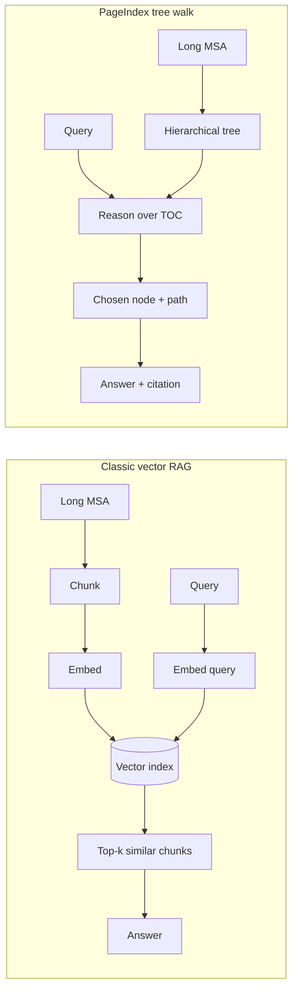
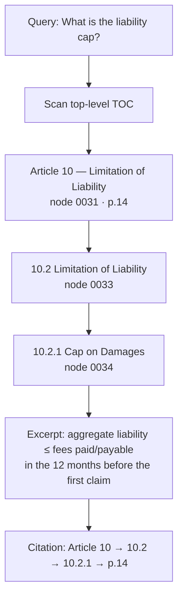

# How PageIndex works (and what this demo fakes)

Concept note for the Lumin Sign contract Q&A demo. Not an API reference.

Upstream: **[VectifyAI/PageIndex](https://github.com/VectifyAI/PageIndex)** (MIT) — vectorless, reasoning-based RAG. A document becomes a **hierarchical tree** (a TOC the model can walk). Retrieval is “which section would a lawyer open next?”, not “which chunk embedding is nearest?”

## Vector RAG vs PageIndex

Classic RAG **cuts the doc into chunks**, embeds them, and **searches by similarity**. That is fast and cheap, but similarity ≠ relevance: a liability *disclaimer* can look like a liability *cap*, and a 25-page MSA has many near-duplicate “shall not be liable” sentences.

PageIndex **keeps the document’s own structure**. An indexer builds a tree of articles → sections → clauses, each node carrying a title, page span, and (optionally) a short summary. At query time an LLM **reasons down the tree** like a human with a table of contents, then reads only the nodes it opened.

| | Vector RAG | PageIndex |
| --- | --- | --- |
| Index | Chunks + embeddings + vector DB | Tree of sections (`node_id`, title, pages, summary) |
| Retrieve | Nearest-neighbor / hybrid search | Reasoned walk over the TOC |
| Cite | “Chunk #47” / overlapping windows | Explicit path: Article → clause → page |
| Weak spot | Similar-but-wrong clauses | Needs a good tree (and a thinking model in production) |

## Core idea: walk the TOC

1. **Index once** — recover or generate the outline (articles, exhibits, nested 10.2.1-style clauses). Each node maps to real pages.
2. **Ask** — the model sees titles/summaries (not the whole PDF) and picks a child, the way you skip from “Article 10 Limitation of Liability” to “10.2.1 Cap on Damages”.
3. **Read + cite** — only then load that node’s text. The citation is the **path you walked**, not a cosine score.

That is why PageIndex is a strong fit for long legal PDFs: the MSA already *is* a tree.

## How this demo maps to that

Happy path is **offline**. No PageIndex Cloud, no LLM key.

| Production PageIndex | This demo |
| --- | --- |
| Parse PDF → build tree (SDK / Cloud) | Fixture MSA + `public/fixtures/pageindex-tree.json` |
| LLM chooses the next node | Scripted walk for canned chips; keyword fallback for free text |
| Model writes the answer | Fixture answers (or the node `summary`) |
| Page-level (or block-level) cite | `Article 10 → 10.2 → 10.2.1 → p.14` |

Pipeline the UI actually runs:

**fixture MSA → prebuilt tree → deterministic walk → tree-path citation (section → page)**

- Tree nodes have stable `node_id`s, titles, `start_index`/`end_index` pages, `summary`, `excerpt`, and body `text` — the same shape as [PageIndex’s tree](https://github.com/VectifyAI/PageIndex).
- Canned chips (liability, confidentiality, termination, data/subprocessors, IP, governing law) each store an ordered list of nodes plus a one-line “why this child” reason. The pane **animates that path** so you see structure-reasoning, not a search hit list.
- The document pane is the same tree flattened onto 25 paper pages; highlight + excerpt follow the leaf you landed on.

Optional `VITE_PAGEINDEX_API_KEY` / `VITE_OPENAI_API_KEY` only unlock a Live **placeholder**. They are never required. A real hook would replace the walker with the [PageIndex client](https://github.com/VectifyAI/PageIndex).

## Example walk: “What is the liability cap?”

Why not stop at Article 10? The article also has a consequential-damages disclaimer and carve-outs. The walk **narrows** until the node that states the twelve-month fees cap. Same pattern, different depth, on the other chips (e.g. Article 6 → 6.4 for the five-year confidentiality term).

## What this is not

- Not vector search with a tree painted on afterward.
- Not a substitute for counsel; the MSA is a demo fixture.
- Not a live PageIndex/LLM integration on the default path.

Run the app from [README.md](./README.md). Read the real system at [github.com/VectifyAI/PageIndex](https://github.com/VectifyAI/PageIndex).
