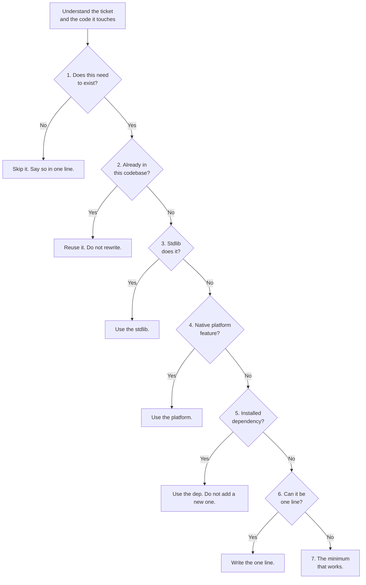
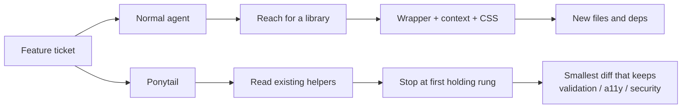
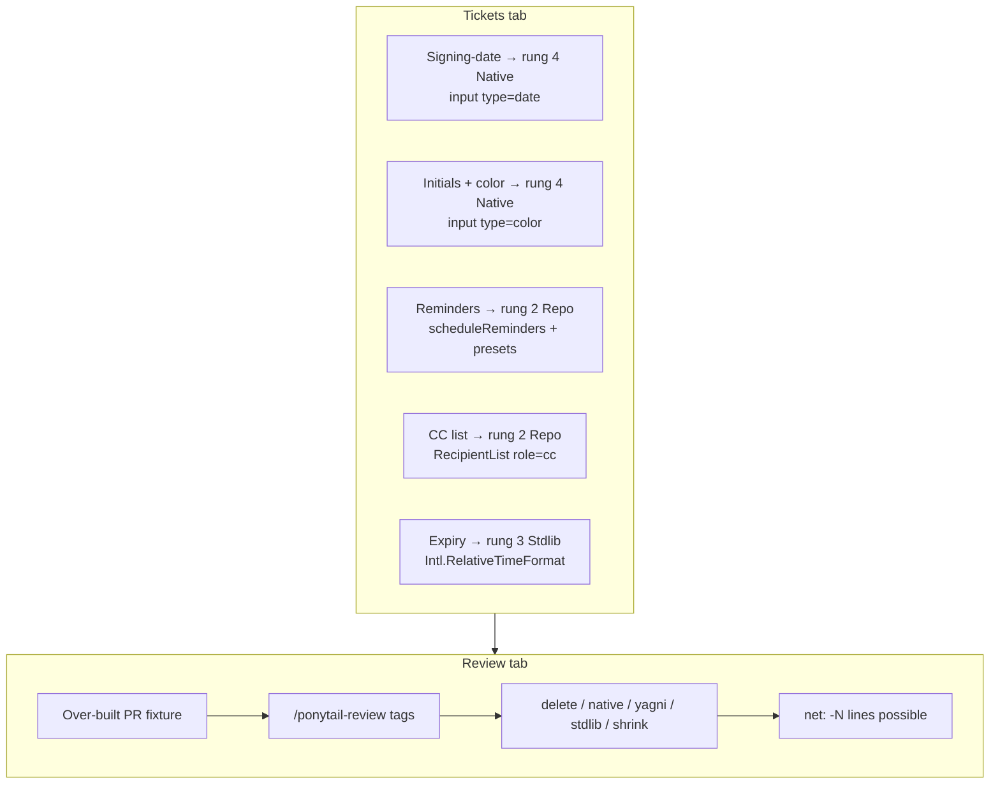

# How Ponytail works (and how this demo maps)

[Ponytail](https://github.com/DietrichGebert/ponytail) is one prompt: before an agent writes code, it climbs a ladder and **stops at the first rung that holds**. It is lazy about the *solution*, not about reading. Trust-boundary validation, data-loss handling, security, and accessibility are never on the chopping block.

This demo does not run Claude Code. It replays five Lumin Sign tickets with fixtures so you can see the stop-rung, the diff, and the live widget.

## The YAGNI ladder

Two rungs would work → take the higher one and move on. Output shape: code first, then `skipped: X. add when Y.`

## Normal vs Ponytail paths

Caveman is a different skill: it shrinks *prose*. Ponytail shrinks *code*. The authors’ published suite (12 feature tasks, Haiku 4.5, n=4) reported Ponytail −54% LOC / −20% cost / −27% time vs no-skill, and Caveman −20% LOC with a slight cost/time *increase*. Those numbers are that suite, not a promise for every repo.

## How the demo maps

| Demo surface | Upstream idea |
| --- | --- |
| Highlighted ladder rung | First holding rung in `skills/ponytail/SKILL.md` |
| `skipped` / `add when` lines | Ponytail output contract |
| “Never cut” chips | Validation / a11y / security exclusions |
| Review tags | `skills/ponytail-review/SKILL.md` |
| Offline fixture + optional env key | Demo must run with no secrets |
| Published suite table | Authors’ agentic benchmark, labeled as such |

The fixture repo is a small Lumin Sign envelope app that already has `formatDate`, `scheduleReminders`, `RecipientList` (including `role="cc"`), `isEmail`, and `expiresAt`. Normal agents ignore that shelf. Ponytail reads it first.
