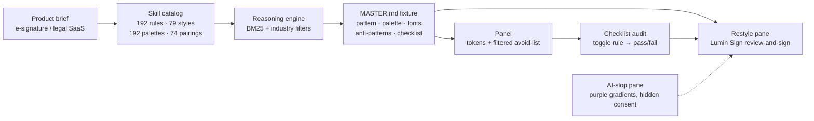

# How this demo works

[UI/UX Pro Max](https://github.com/nextlevelbuilder/ui-ux-pro-max-skill) is an agent skill that gives coding agents design judgment. You describe a product; it searches a catalog (192 industry rules, 79 UI styles, 192 palettes, 74 font pairings) and emits a full design system: page pattern, colors, fonts, effects, anti-patterns, and an accessibility checklist (contrast, focus, reduced-motion, 375 / 768 / 1024 / 1440).

This app does not run the Python search on every page load. It **commits** one generated `MASTER.md` so `bun install && bun run dev` stays offline. The optional `scripts/generate-design-system.sh` can re-run the upstream generator; that path is env/docs only and never needs committed keys.

## Catalog → design system → restyle

1. **Search.** The generator query was `e-signature legal SaaS contract signing review and sign`. It matched **E-signature / Document Workflow** (and nearby Legal Services / Banking rows).
2. **Filter.** E-sign anti-patterns are *confusing signing flow*, *weak audit trail*, *hidden consent*. Adjacent legal/finance rows also forbid *AI purple/pink gradients* and playful chrome. Those filters are what the left pane deliberately violates.
3. **Persist.** `search.py --design-system --persist` wrote `design-system/lumin-sign/MASTER.md`: Enterprise Gateway, Minimalism & Swiss Style, navy `#1E3A5F` + signature green `#16A34A`, EB Garamond / Lato, plus the pre-delivery checklist.
4. **Restyle.** The right-hand page is the same MSA countersign ceremony as the slop page, implemented from those tokens: document preview, field placement, explicit consent, audit trail.
5. **Audit.** Each checklist item is a live class on the restyle root. Off = a visible failure of that rule; on = the page passes again.

## Why the slop page looks like that

Generic “AI UI” for legal work usually ships the catalog’s **forbidden** set: mesh purple-pink, Inter + emoji, glass cards, inferred consent, no audit log, and a signing path you cannot narrate. The skill’s job is to refuse that default when the industry is legal, finance, or e-sign.

## Checklist audit

| Rule | Pass (on) | Fail (off) |
| --- | --- | --- |
| No emoji icons | Heroicons-style SVGs | Emoji substitution |
| Consistent icon set | One stroke set, one color | Pink, skewed marks |
| `cursor-pointer` | Pointer on controls | Default cursor |
| Hover 150–300ms | Eased hover | Instant snap |
| Contrast 4.5:1 | Navy / ink on slate-50 | Grey-on-grey |
| Visible focus | 2px ring + offset | `outline: none` |
| Reduced motion | Pulse stops under the preference | Infinite bounce |
| 375 / 768 / 1024 / 1440 | Frame chips reflow | Forced wide flex |
| Header overlap | Body clears the bar | Sticky header covers the title |
| No horizontal scroll | Lines wrap | Nowrap overflow |
| No purple gradients | Navy / green legal chrome | Slop palette on the restyle |

## Offline fixture vs optional regenerate

- Runtime reads `design-system/lumin-sign/MASTER.md` (and `industry-filters.json` for the legal/finance extras).
- `bun run generate:design-system` clones the skill (or uses `UIUX_PRO_MAX_SKILL_DIR`) and overwrites `MASTER.md`.
- `search.py` is Python 3 + standard library. It does not call the Google Fonts API. **Do not commit `GOOGLE_FONTS_API_KEY`.**
