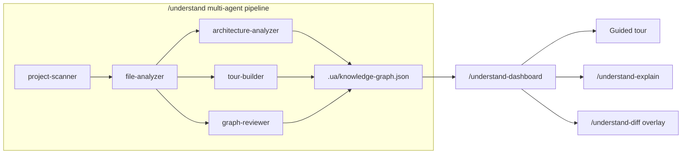
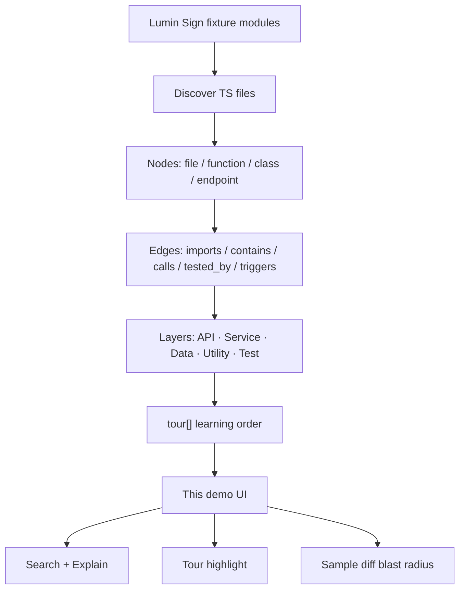

# How Understand Anything works (and what this demo fakes)

Concept note for the Lumin Sign **code** knowledge-graph demo. Not an API reference.

Upstream: **[Egonex-AI/Understand-Anything](https://github.com/Egonex-AI/Understand-Anything)** (MIT) — a multi-agent `/understand` pipeline that turns a codebase into `.ua/knowledge-graph.json`, then an interactive dashboard you can tour, search, explain, and `/understand-diff`.

Sibling demo: **[Graphify contract KG](../graphify-contract-kg/)** extracts **parties / clauses / obligations** from contracts. This demo extracts **files / functions / call edges** from e-sign *code*. Same “graph you can ask questions of,” different corpus.

## Commands (upstream)

| Command | Role |
| --- | --- |
| `/understand` | Multi-agent pipeline → `.ua/knowledge-graph.json` |
| `/understand-dashboard` | Interactive graph UI |
| `/understand-explain <path>` | Deep-dive one node + neighborhood + source |
| `/understand-diff` | Changed files → 1-hop affected + `diff-overlay.json` |
| `/understand-chat` / `/understand-onboard` / `/understand-domain` | Q&A, onboarding guide, business-domain graph (not in this MVP) |

## Multi-agent pipeline → graph → tour / explain / diff

Static analysis and LLMs split the work:

- **Tree-sitter (deterministic)** — files, functions, classes, imports, call sites. Same code → same structural edges.
- **LLM agents (semantic)** — summaries, tags, architectural layers, guided tours, language lessons.

`/understand` orchestrates five agents (domain/knowledge modes add more):





### Graph schema (faithful)

Top-level object matches upstream `KnowledgeGraph`:

- `version`, optional `kind: "codebase"`
- `project` — name, languages, frameworks, description, `analyzedAt`, `gitCommitHash`
- `nodes[]` — `id`, `type`, `name`, `filePath?`, `lineRange?`, `summary`, `tags[]`, `complexity`, `languageNotes?`
  - IDs: `file:path`, `function:path:name`, `class:path:name`, `endpoint:path:METHOD /route`, `module:dir`, `document:README.md`
- `edges[]` — `source`, `target`, `type`, `direction`, `weight`, optional `description`
- `layers[]` — `id`, `name`, `description`, `nodeIds[]`
- `tour[]` — `order`, `title`, `description`, `nodeIds[]`, optional `languageLesson`

`/understand-diff` overlay (what the dashboard paints):

```json
{
  "version": "1.0.0",
  "baseBranch": "main",
  "changedFiles": ["src/reminders/scheduler.ts"],
  "changedNodeIds": ["file:src/reminders/scheduler.ts", "function:…:sendDueReminders"],
  "affectedNodeIds": ["file:tests/reminders.test.ts", "function:…:emitWebhook"]
}
```

Changed = every node whose `filePath` is in the diff. Affected = 1-hop via `imports` / `calls` / `contains` / `tested_by` / `triggers`. Tests are the `tested_by` targets. Risk uses complexity + layer count + blast size.

## How this demo maps

Happy path is **offline**. No plugin, no LLM, no key.

| Production Understand Anything | This demo |
| --- | --- |
| `/understand` on a real repo | Committed `fixture-codebase/` + `bun run generate:graph` (extract + authored summaries) |
| `.ua/knowledge-graph.json` | `public/ua/knowledge-graph.json` |
| `/understand-dashboard` | Custom SVG explorer (layer columns, pan/zoom) |
| Guided tours | `tour[]` steps 1–9 through send → route → fields → reminders → webhooks → audit → tests |
| `/understand-explain` | Explain panel: summary, layer, edges, fixture source snippet |
| Fuzzy search (Fuse.js) | Token search over name / tags / summary / path |
| `/understand-diff` + live git | Three committed sample changes + the same 1-hop walk |
| Incremental re-analyze | Not shipped |

Pipeline the UI actually runs:

**fixture TypeScript → committed UA graph → search / tour / explain / sample-diff overlay**

The six fixture modules are the e-sign spine:

1. **Create request** — `createSignatureRequest` orchestrates the rest.
2. **Signer routing** — `ORDER` vs `PARALLEL`.
3. **Field prep** — signature / date / initials bound to signer ids.
4. **Reminders** — cadence `[1, 3, 7]`; due-scan triggers webhooks + audit.
5. **Webhooks** — emit, retry, inbound viewed/signed/declined.
6. **Audit trail** — append-only; GET audit is the compliance door.

## Understand Anything vs Graphify

| | Understand Anything | Graphify |
| --- | --- | --- |
| Corpus | Source code (and optional wiki / domain / Figma modes) | Code + docs + PDFs as *entities* |
| Node types | file, function, class, endpoint, … | party, clause, obligation, term, … |
| Edge why | Structural (`calls`, `imports`) + optional description | Every edge has EXTRACTED / INFERRED / AMBIGUOUS + a legal why |
| Job to be done | “How does this codebase fit together?” | “What does this contract bind whom to?” |

## What this is not

- Not a live `/understand` run. Regenerating with the real plugin is documented in [README.md](./README.md); it needs an agent/LLM.
- Not Graphify, PageIndex, or Archify (those are contract/tree/IR demos).
- Not production Lumin Sign. The fixture is a teaching core.

Run the app from [README.md](./README.md). Read the real system at [github.com/Egonex-AI/Understand-Anything](https://github.com/Egonex-AI/Understand-Anything).
